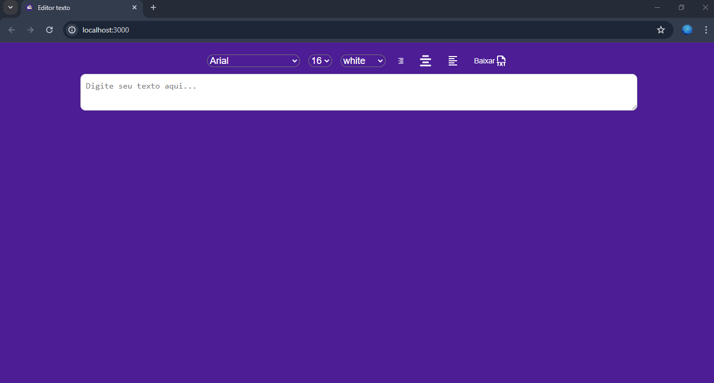

# Projeto: Editor de Texto

## Tecnologias Usadas
  - Reactjs
  - Cypress
### Teste unitarios 
  - Utilizando o Cypress

- Funcionalidades
    - Editor de Texto: Os usuários podem criar e editar conteúdo de texto diretamente no aplicativo.
    - Visualização ao Vivo: O conteúdo editado é exibido em tempo real em uma área de visualização.

- Contribuição
  - Contribuições são bem-vindas! Sinta-se à vontade para abrir um problema ou enviar um pull request para sugerir melhorias ou corrigir problemas.
